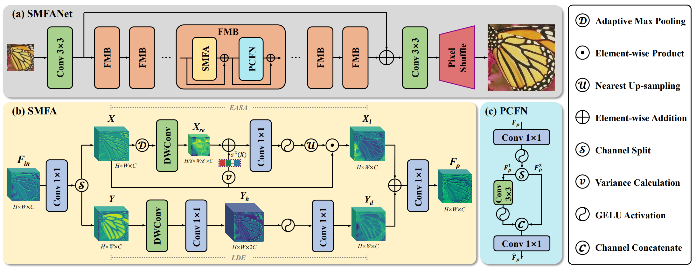

# [NTIRE 2024 Challenge on Efficient Super-Resolution](https://cvlai.net/ntire/2024/) @ [CVPR 2024](https://cvpr2024.thecvf.com/)

## 📖 SMFAN: A Lightweight Self-Modulation Feature Aggregation Network for Efficient Image Super-Resolution
### We placed 2nd and 3rd in the Parameters and FLOPs sub-track of the NTIRE2024 ESR Challenge.
---
<p align="center">
  
</p>

*An overview of the proposed SMFAN*


### How to test the model?

1. Run the [`run.sh`] script (./run.sh)
    ```bash
    CUDA_VISIBLE_DEVICES=0 python test_demo.py --data_dir [path to your data dir] --save_dir [path to your save dir] --model_id 24
    ```
    - Be sure the change the directories `--data_dir` and `--save_dir`.

   
### How to calculate the number of parameters, FLOPs, and activations

```python
    from utils.model_summary import get_model_flops, get_model_activation
    from models.team24_smfan import SMFAN
    model = SMFAN(dim=24, n_blocks=8, ffn_scale=1.5, upscaling_factor=4, bias=False)
    
    input_dim = (3, 256, 256)  # set the input dimension
    activations, num_conv = get_model_activation(model, input_dim)
    activations = activations / 10 ** 6
    print("{:>16s} : {:<.4f} [M]".format("#Activations", activations))
    print("{:>16s} : {:<d}".format("#Conv2d", num_conv))

    flops = get_model_flops(model, input_dim, False)
    flops = flops / 10 ** 9
    print("{:>16s} : {:<.4f} [G]".format("FLOPs", flops))

    num_parameters = sum(map(lambda x: x.numel(), model.parameters()))
    num_parameters = num_parameters / 10 ** 6
    print("{:>16s} : {:<.4f} [M]".format("#Params", num_parameters))
```